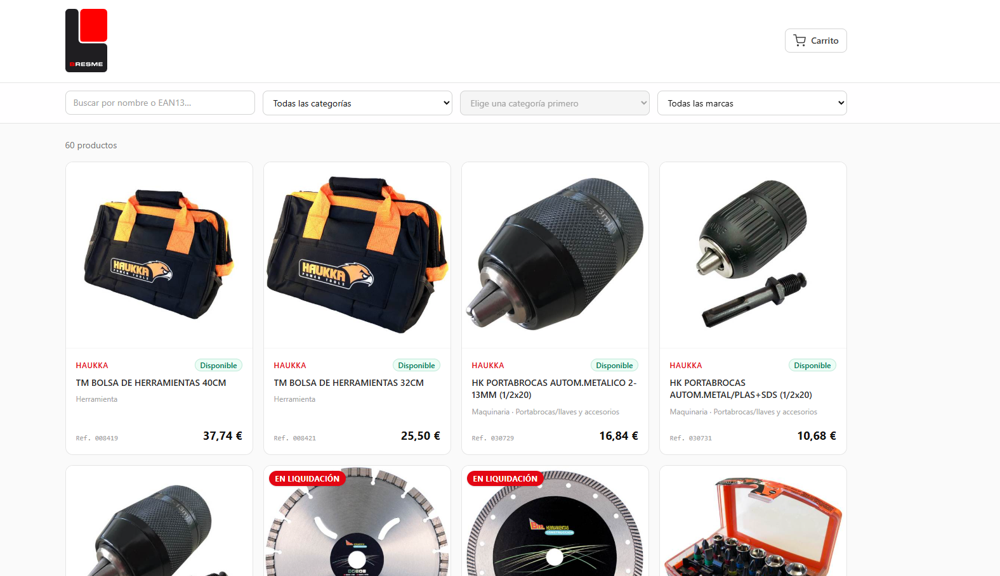
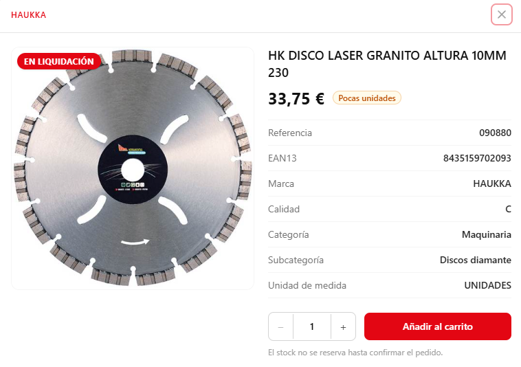
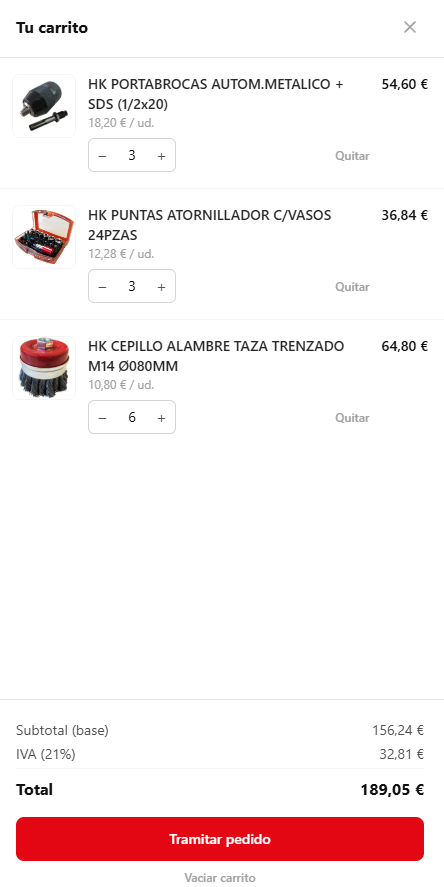
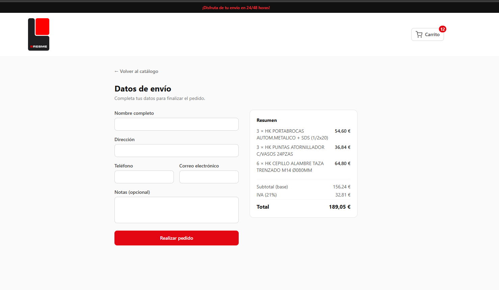
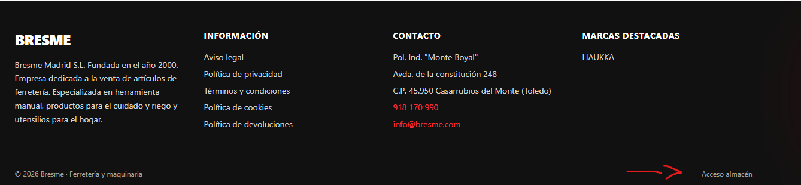
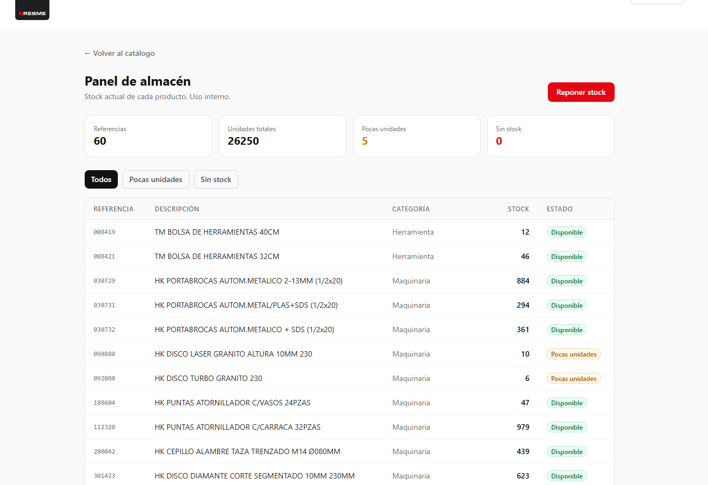
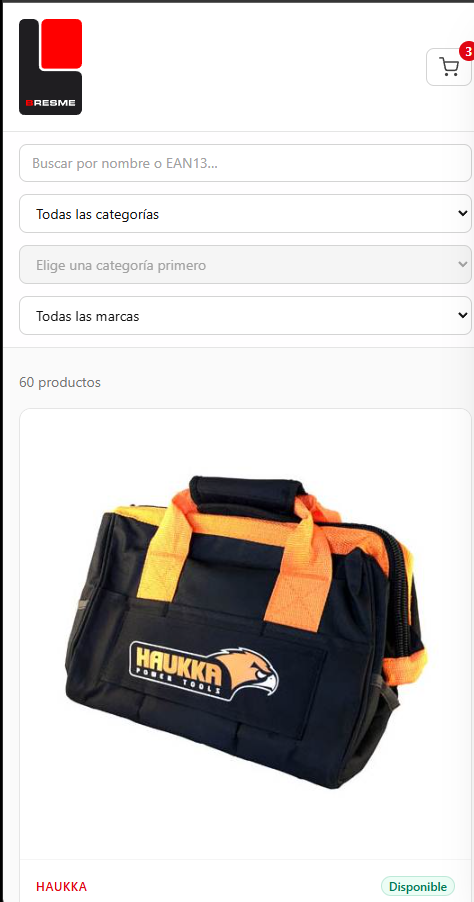
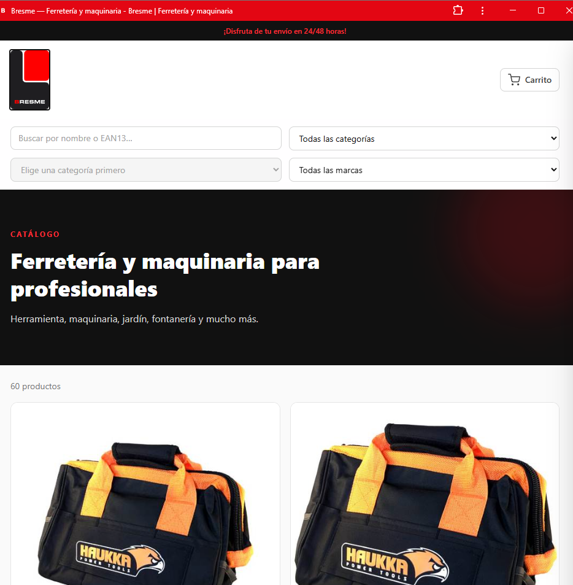
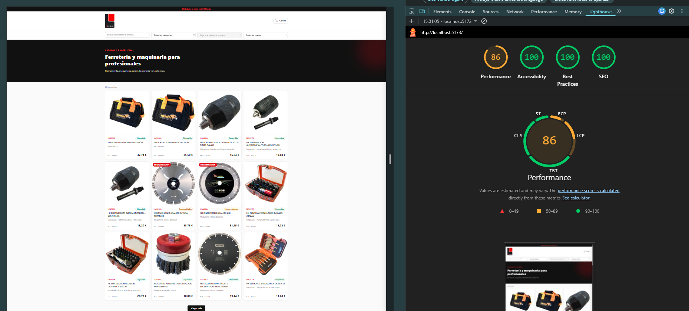
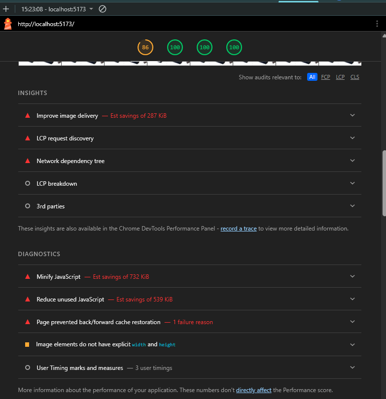

# Mini-tienda online — Bresme

Prueba técnica · Desarrollador Web & App. Catálogo de 60 artículos reales de
Bresme (marca HAUKKA) con filtros, ficha de producto, carrito persistente,
checkout simulado y **stock funcional**. Construida con
**React + Vite + Tailwind CSS v4**.

> Las imágenes de producto se obtienen automáticamente desde
> [bresme.com](https://www.bresme.com) mediante un script (ver
> [Automatización de imágenes](#automatización-de-imágenes)).

---

## Tabla de contenidos

- [Stack](#stack)
- [Cómo arrancar](#cómo-arrancar)
- [Estructura del proyecto](#estructura-del-proyecto)
- [Decisiones técnicas y de arquitectura](#decisiones-técnicas-y-de-arquitectura)
- [Stock simulado y panel de almacén](#stock-simulado-y-panel-de-almacén)
- [Calidad: accesibilidad, SEO y rendimiento](#calidad-accesibilidad-seo-y-rendimiento)
- [Automatización de imágenes](#automatización-de-imágenes)
- [Bonus: app instalable (PWA)](#bonus-app-instalable-pwa)
- [De web a app (parte teórica)](#de-web-a-app-parte-teórica)
- [Cuestionario sobre uso de IA](#cuestionario-sobre-uso-de-ia)
- [Capturas](#capturas)

---

## Stack

- **React 18** con **Vite** como bundler y servidor de desarrollo.
- **Tailwind CSS v4** (plugin `@tailwindcss/vite`; los colores de marca se
  definen con `@theme` en `src/index.css`).
- **Datos**: archivo JSON local (`src/data/productos.json`). No hay base de
  datos ni backend; el enunciado permite datos en memoria/JSON.
- **Automatización de imágenes**: scripts en Node nativo (sin dependencias).

---

## Cómo arrancar

### Requisitos

- **Node.js 18 o superior** (uso `fetch` y módulos nativos; probado con Node 22).
- npm.

### Pasos

```bash
# 1. Clonar el repositorio
git clone https://github.com/Arturo260403/Tienda_Online_Bresme.git
cd Tienda_Online_Bresme

# 2. Instalar dependencias
npm install

# 3. Descargar las imágenes de producto desde bresme.com
node automatizacion/descargar-imagenes.mjs

# 4. (Opcional) Descargar el logo y el favicon de Bresme
node automatizacion/descargar-marca.mjs

# 5. Arrancar el servidor de desarrollo
npm run dev
```

Abre la URL que indica la terminal (por defecto `http://localhost:5173`).

### Build de producción

```bash
npm run build     # genera dist/
npm run preview   # sirve dist/ localmente para revisarlo
```

---

## Estructura del proyecto

```
.
├── automatizacion/
│   ├── descargar-imagenes.mjs   # descarga imágenes de producto desde bresme.com
│   └── descargar-marca.mjs      # descarga logo + favicon de Bresme
├── public/
│   ├── imagenes/                # imágenes de producto (generadas por el script)
│   ├── logo-bresme.svg          # logotipo
│   ├── favicon-bresme.png       # favicon
│   ├── icono-192.png            # icono PWA
│   ├── icono-512.png            # icono PWA
│   └── robots.txt               # para buscadores
├── src/
│   ├── componentes/
│   │   ├── Cabecera.jsx          # franja de envío + logo + acceso al carrito
│   │   ├── BarraFiltros.jsx      # filtros encadenados + buscador
│   │   ├── TarjetaProducto.jsx   # tarjeta del catálogo
│   │   ├── FichaProducto.jsx     # modal con ficha técnica
│   │   ├── DesplegableCarrito.jsx# panel lateral del carrito
│   │   ├── FormularioPedido.jsx  # checkout simulado
│   │   ├── PanelAlmacen.jsx      # panel de stock (uso interno)
│   │   └── MiniaturaProducto.jsx # placeholder "Sin imagen"
│   ├── contexto/
│   │   ├── ContextoCarrito.jsx   # estado global del carrito + persistencia
│   │   └── ContextoInventario.jsx# estado global del stock + persistencia
│   ├── librerias/
│   │   └── formato.js            # formateo de precios y etiquetas de stock
│   ├── data/
│   │   └── productos.json        # 60 productos ya procesados
│   ├── App.jsx                   # orquestador (vistas, filtros, paginación)
│   ├── main.jsx                  # punto de entrada (envuelve los proveedores)
│   └── index.css                 # Tailwind v4 + paleta corporativa
└── index.html
```

---

## Decisiones técnicas y de arquitectura

### Procesado de los datos

A partir del Excel original generé `productos.json` aplicando varias
transformaciones, y durante el análisis detecté **tres particularidades de los
datos** que condicionaron el diseño:

- **Una sola marca.** Los 60 artículos son de la marca HAUKKA. El filtro por
  marca es obligatorio según el enunciado, así que lo implementé igualmente,
  aunque con este conjunto de datos solo ofrezca una opción. Preferí dejarlo
  documentado a esconderlo.
- **Ningún producto con stock 0.** El inventario va de 2 a 6.341 unidades.
  Para mostrar el stock como texto definí estos umbrales: `Sin stock` si es 0,
  `Pocas unidades` si es ≤ 10, y `Disponible` si es > 10. El número exacto se
  guarda en el JSON para la lógica interna pero **nunca se muestra** en la
  interfaz, como pide el enunciado.
- **Subcategorías huérfanas.** 12 de los 60 productos tienen un código de
  subcategoría que no existe en el catálogo de subcategorías. A esos les asigné
  el valor de respaldo `"General"` en lugar de dejar huecos.

Otros campos: `enLiquidacion` se convirtió de "Sí"/"No" a booleano; `id` y
`ean13` se guardan como cadena para no perder los ceros a la izquierda.

### IVA

El enunciado pide mostrar "subtotal e IVA del 21% calculado aparte". Asumí que
el **PVP es la base imponible** y el 21% se suma encima
(`subtotal → +IVA → total`). Es la interpretación que produce el desglose
"aparte" que se pide literalmente. Conviene saber que "PVP" en España suele
incluir IVA, por lo que existe la interpretación contraria (extraer el IVA del
precio); por eso el tipo está en una sola constante (`IVA` en
`ContextoCarrito.jsx`) y cambiarlo es trivial.

### Arquitectura de componentes

- **Separación por responsabilidades** en `componentes/`, `contexto/` y
  `librerias/`, dejando `App.jsx` como orquestador (estado de UI, filtrado y
  composición).
- **Estado global con Context + `useReducer`** para el carrito y para el
  inventario, sin prop drilling. La **persistencia** se hace con `localStorage`:
  se lee al iniciar (lazy initializer) y se reescribe en cada cambio con un
  `useEffect`. Los totales del carrito son **derivados** (se recalculan en cada
  render), no se guardan, lo que evita estados desincronizados.
- **Filtros encadenados**: la subcategoría depende de la categoría
  seleccionada, lo que resuelve la ambigüedad del valor `"General"`.
- **Paginación "Cargar más"** en lugar de scroll infinito: más simple, sin
  listeners de scroll y más fácil de verificar.
- **Responsive**: rejilla de 1 a 4 columnas según el ancho y barra de filtros
  adaptable.

### Paleta corporativa

Definida con `@theme` (Tailwind v4): rojo `#e30613`, negro `#111111` y blanco.
Mantuve colores semánticos (verde/ámbar) **solo** en la etiqueta de
disponibilidad, porque ahí el color comunica un estado.

---

## Stock simulado y panel de almacén

El stock es **funcional y reacciona a las compras**, simulado en el navegador
(`localStorage`), ya que el proyecto no tiene backend.

### Modelo sin reserva

El stock **no baja al añadir al carrito**; baja **únicamente al confirmar el
pedido**. Tener un producto en el carrito no garantiza su disponibilidad. Es el
modelo de tiendas con stock limitado, y evita reservas con temporizador que,
sin un backend compartido, serían solo decorativas.

Cómo se refleja en la interfaz:

- La disponibilidad (`Disponible` / `Pocas unidades` / `Sin stock`) se calcula
  a partir del stock **real** en cada momento.
- En la ficha, la cantidad se puede **escribir** o ajustar con `+` / `−`. Si
  supera el stock, avisa ("Solo quedan N unidades") y no deja añadir.
- Si un producto llega a 0, el botón pasa a "Sin stock" y se deshabilita.
- Aviso explícito en la ficha: *"El stock no se reserva hasta confirmar el
  pedido."*
- Al confirmar el pedido, se descuentan las unidades y el estado se actualiza.

### Panel de almacén (uso interno)

Vista que simula la gestión de inventario de un trabajador (acceso discreto en
el pie, "Acceso almacén"): stock por referencia, resumen (referencias, unidades
totales, pocas unidades, agotados), filtros por estado y un botón **"Reponer
stock"** que restablece el inventario a los valores del catálogo (útil también
para reiniciar tras las pruebas).

### Límites conscientes (qué haría en producción)

- El stock vive en `localStorage`; en un sistema real estaría en un **backend
  con base de datos compartida**, única fuente de verdad para web, app y almacén.
- El acceso al panel estaría **protegido tras autenticación** (rol de
  administrador). No implemento login porque, sin backend, sería solo
  decorativo y no aportaría seguridad real.
- La reposición permitiría **fijar o sumar cantidades** (entrada de mercancía),
  no solo restablecer; lo limito a un reseteo porque el stock de partida es el
  del Excel y no quería inventar datos fuera del enunciado.

---

## Calidad: accesibilidad, SEO y rendimiento

Auditoría con **Lighthouse** (Chrome DevTools), sobre la vista de catálogo:

- **Accesibilidad: 100**
- **Buenas prácticas: 100**
- **SEO: 100**
- **Rendimiento: 86**

**Accesibilidad.** Etiquetas asociadas a cada control de formulario, foco
visible, modal con `role="dialog"`/`aria-modal` y cierre con Escape, tarjetas
operables por teclado y **contraste de color revisado** (ajusté los rojos sobre
fondo oscuro y los grises de menor contraste para cumplir el ratio mínimo).

**Rendimiento (86).** La medición se hace en **modo desarrollo**, donde Vite no
minifica el JavaScript (de ahí los avisos "Minify/Reduce JavaScript"); en la
**build de producción** ese coste desaparece. El margen restante corresponde a
las **imágenes de producto**, que se sirven tal cual desde bresme.com sin
optimizar (no las reescalo ni convierto a WebP para no alterar el material
original). Ambos puntos son conocidos y de solución directa.

---

## Automatización de imágenes

### Estrategia elegida

Tras inspeccionar una ficha real de bresme.com, comprobé que **la URL de la
imagen se deriva directamente de la referencia del producto** (el campo `id`):

```
https://www.bresme.com/img/personalizacion/bresme/products/zoom/{REFERENCIA}.jpg
https://www.bresme.com/img/personalizacion/bresme/products/list/{REFERENCIA}.jpg
```

Por eso **no scrapeo HTML ni adivino slugs** (que en bresme.com son
inconsistentes). El script `automatizacion/descargar-imagenes.mjs`:

1. Recorre los 60 productos del JSON.
2. Construye la URL desde la referencia (primero `zoom`, luego `list` como
   respaldo).
3. **Verifica** que la respuesta es `200`, que el `content-type` es una imagen
   y que pesa más de 1 KB (descarta páginas de error/placeholders).
4. Descarga el archivo a `public/imagenes/{ref}.jpg` y actualiza el campo
   `imagen` del JSON.
5. Si no encuentra imagen, deja `imagen: null` (placeholder) y lo registra.

### Por qué esta estrategia

- **Robusta**: cada URL se valida en tiempo real; no se asume nada.
- **Rápida**: una petición por producto, sin parsear páginas.
- **Honesta**: reporta la cobertura real y registra los fallos.
- **Sin dependencias**: usa `fetch` y `fs` nativos de Node.

### Cobertura conseguida

**60/60 imágenes (100%)**, 0 sin imagen. Funcionó tanto con referencias
numéricas (`030729`) como con las que llevan prefijo `P` (`P19287`), porque usa
la referencia tal cual sin asumir formato.

---

## Bonus: app instalable (PWA)

Como bonus opcional, la web es además una **PWA (Progressive Web App)**
instalable y con soporte offline, usando `vite-plugin-pwa`.

- **Por qué PWA y no una app aparte:** el enunciado lista la PWA como una de las
  opciones válidas para el bonus. Convertir la web en PWA reaprovecha el 100%
  del código ya hecho y conecta directamente con la sección teórica de más
  abajo. Por eso **no existe una carpeta `app/`**: la app *es* la propia web
  instalable.
- **Qué incluye:** un *Web App Manifest* (nombre, iconos de 192 y 512 px, color
  corporativo) y un *service worker* que precachea el App Shell y las imágenes.
- **Cómo probarlo:** `npm run dev` y usar el botón "Instalar" del navegador, o
  `npm run build && npm run preview` para producción. Auditable con Lighthouse y
  en la pestaña *Application* de DevTools.

---

## De web a app (parte teórica)

### ¿Cómo convertiría esta experiencia en una app para iPad y Android?

Para el caso concreto de Bresme —un catálogo con carrito y checkout, donde el
contenido cambia poco y no se necesita hardware del dispositivo— las opciones se
valoran así:

- **PWA (Progressive Web App).** La opción más rentable: reaprovecha casi todo
  el código React actual, se instala desde el navegador, funciona offline con un
  service worker y se actualiza sin pasar por las tiendas. *Contras*:
  integración limitada con funciones nativas y, en iOS, algunas limitaciones de
  notificaciones y almacenamiento.
- **Híbrida (React Native / Flutter / .NET MAUI).** Un único código para iOS y
  Android con apps reales en las tiendas y buen acceso a APIs nativas. **React
  Native** sería la más natural por la afinidad con el stack actual. *Contras*:
  hay que reescribir la capa de UI, mantener publicación en stores y gestionar
  dependencias nativas.
- **Nativa (Swift + Kotlin).** Máximo rendimiento e integración, pero dos bases
  de código y el mayor coste. **Injustificada** para un catálogo de este tipo.

**Recomendación para Bresme:** empezar por **PWA** y, si el negocio exige
presencia en stores o funciones nativas, dar el salto a **React Native**.

### ¿Qué cambiaría del backend o del API?

Hoy los datos están en un JSON local. Para servir a web y app a la vez,
extraería una **API REST (o GraphQL) común** como única fuente de verdad:

- Endpoints como `GET /productos`, `GET /productos/{id}`, `GET /categorias` y un
  `POST /pedidos` para el checkout real.
- **Paginación, filtrado y búsqueda en servidor** (hoy se hacen en cliente
  porque son solo 60 productos; con miles no sería viable).
- El **stock** viviría aquí (no en `localStorage`), como fuente compartida entre
  web, app y el panel de almacén.
- El cálculo de IVA y totales debería confirmarse en servidor.

### ¿Qué patrones de navegación y UX cambian?

- En móvil, los filtros suelen ir en un **panel/bottom sheet** desplegable y la
  navegación en una **tab bar inferior**.
- El carrito lateral (drawer) encaja en móvil, pero el checkout conviene
  dividirlo en **pasos** en pantallas pequeñas.
- Gestos táctiles, objetivos de toque más grandes y teclado contextual.

### ¿Cómo manejaría el modo offline?

- **PWA**: service worker que cachea el App Shell y las imágenes; el catálogo se
  guarda en IndexedDB para consultarlo sin conexión.
- El **carrito ya es offline-first** (vive en almacenamiento local).
- Los pedidos creados sin conexión se encolarían y se sincronizarían al
  recuperar la red (background sync).

### ¿Qué reutilizaría y qué tiraría?

- **Reutilizaría**: toda la **lógica** (filtrado, carrito, stock, cálculo de
  IVA, formateo, modelo de datos) y las decisiones de UX; en una PWA, además,
  casi todos los componentes React.
- **Tiraría/adaptaría**: en una app nativa o React Native, la **capa de
  presentación** basada en HTML + Tailwind, que habría que reescribir con los
  componentes de cada plataforma.

---

## Cuestionario sobre uso de IA

**1. ¿Qué herramientas de IA usaste y para qué tareas concretamente?**

Usé **Claude (Anthropic)** como asistente principal, en tareas concretas:

- Analizar el Excel y diseñar el `productos.json` (mapeo del stock a texto,
  valor de respaldo `"General"` para las subcategorías).
- Configurar el proyecto: Vite + Tailwind CSS v4 (con el método de instalación
  correcto de la v4).
- Generar los componentes React.
- Diseñar el script de automatización de imágenes, partiendo de inspeccionar
  cómo bresme.com sirve las imágenes por referencia.

**2. Pega aquí 1 prompt completo (sin recortar) que te resultó útil.**

```
Hola Claude. He adjuntado el Excel con los 60 productos de la empresa Bresme y las instrucciones de mi prueba técnica para que los analices. Actúa como un Ingeniero de Software Principal. Confírmame que puedes leer correctamente ambos archivos y hazme un breve resumen de los requisitos obligatorios que debe tener la tienda online.
```

**3. ¿En qué momentos decidiste NO usar IA y por qué?**

En las **decisiones de criterio y de producto**, que preferí tomar yo:

- Elegir la paleta de colores.
- Ajustes visuales, tamaño del logo.
- Comportamiento responsive.
- Organización de carpetas y archivos.
- Verificar los datos del Excel a mano.
- Decidir los umbrales de stock: cuándo algo es "Pocas unidades" vs "Disponible".
- La interpretación del IVA.
- Elegir "Cargar más" en lugar de scroll infinito.
- Añadir el stock simulado con su panel de almacén.

**4. Un caso en el que la IA te dio una respuesta que NO usaste tal cual.
¿Cómo te diste cuenta y qué hiciste?**

Un caso claro: al montar el checkout, la función para vaciar el carrito se
llamaba `vaciar` en mi contexto, pero en un momento se mencionó `vaciarCarrito`,
que no existía; usarlo tal cual habría dado error. Lo detecté al contrastar el
nombre con el que estaba definido en `ContextoCarrito.jsx` y usé el correcto.
Otro: una clase de tamaño de Tailwind (`h-25`) que **no existe** en la escala
por defecto; no se aplicaba el tamaño esperado, así que la sustituí por un valor
válido.

**5. ¿Cómo verificas que la IA no se inventa funciones, imports, librerías o
sintaxis que no existen?**

- **Ejecuto el código y leo los errores** de la consola y de Vite: los imports
  que no resuelven o los nombres inexistentes saltan enseguida (me pasó con
  rutas de import mal puestas que daban pantalla en blanco).
- **Compruebo que los nombres coinciden** con lo que está realmente definido
  (funciones del contexto, props de los componentes).
- **Contrasto con la documentación oficial** cuando algo "huele" a versión
  antigua (por ejemplo, la instalación de Tailwind cambió de la v3 a la v4).

**6. ¿En qué partes de tu día a día crees que la IA aporta más? ¿Y en cuáles
poco o nada?**

Aporta más en: código repetitivo, montar la estructura inicial, explorar
herramientas o versiones que no uso a diario, y depurar errores con un mensaje
concreto. Aporta poco en: decisiones de producto y de negocio, entender las
particularidades reales de los datos del cliente, y el criterio de diseño; ahí
hace falta contexto y gusto que la IA no tiene.

**7. Tres reglas para alguien que empieza a usar IA para programar.**

1. **Ejecuta y verifica siempre**: nunca pegues código a ciegas.
2. **Entiende lo que pegas**: si no sabes qué hace una línea, pregunta antes de
   usarla.
3. **Las decisiones son tuyas**: la IA es una herramienta que acelera, pero el
   diseño y el criterio los pones tú.

---

## Capturas

**Catálogo (escritorio)**



**Ficha de producto**



**Carrito con desglose de IVA**



**Checkout y confirmación de pedido**



**Enlace panel de almacén (uso interno)**



**Panel de almacén (uso interno)**



**Vista móvil (responsive)**



**App instalada (PWA)**



**Auditoría Lighthouse (puntuaciones)**



**Auditoría Lighthouse (rendimiento)**


